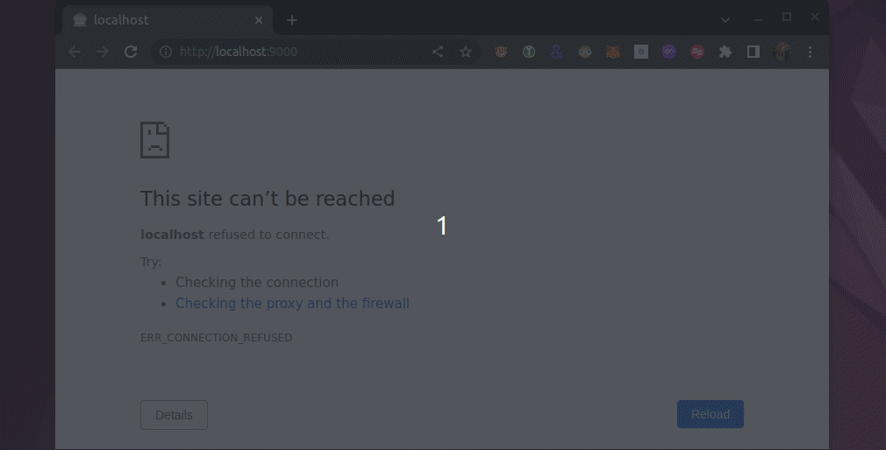

<section align="center">

  

   
   

  <!-- badges -->
  
  
  

  

    <a href="#about">About</a> •
    <a href="#technologies">Technologies</a> •
    <a href="#contribution">Contribution</a> •
    <a href="#author">Author</a> •
    <a href="#license">License</a> •
    <a href="#statistics">Statistics</a>
  

</section>

---

<h2 id="about">💬 About</h2>

Automocker.js was developed to make developers' lives easier! With this tool, you can fill in the input fields of your form with random values and thus speed up your tests. Don't waste any more time manually filling in your form inputs. Use Automocker.js and increase the agility and efficiency of your workflow.

<h2 id="technologies"> 🛠️ Technologies</h2>

* [Webpack 5](https://webpack.js.org/)
* [NodeJS](https://nodejs.dev/)
* [aicommits](https://github.com/Nutlope/aicommits)
* [dothub](https://github.com/andersonbosa/dothub)

<h2>🚀 Deploy</h2>

* Distributed here, in [Github](https://github.com/andersonbosa/automocker)

<h2 id="contribution">🤝 Contribution</h2>

  This project is for study purposes too, so please send me a message telling me what you are doing and why you are doing it, teach me what you know. All kinds of contributions are very welcome and appreciated!

<h2 id="author">👨‍💻 Author</h2>

* [@andersonbosa](https://github.com/andersonbosa)

<h2 id="license"> 📝 License</h2>

This project is under 2 licenses: [MIT](LICENSE.md) and [Unlicense](./UNLICENSE.md).

  

    <h2 id="statistics">📊 Statistics </h2>
  

  
  <h4> Stargazers </h4>
  

  <h4> Forkers </h4>
  

---

<h4>  
  
  | Did you like the repository? Give it a star! 😁
</h4>
